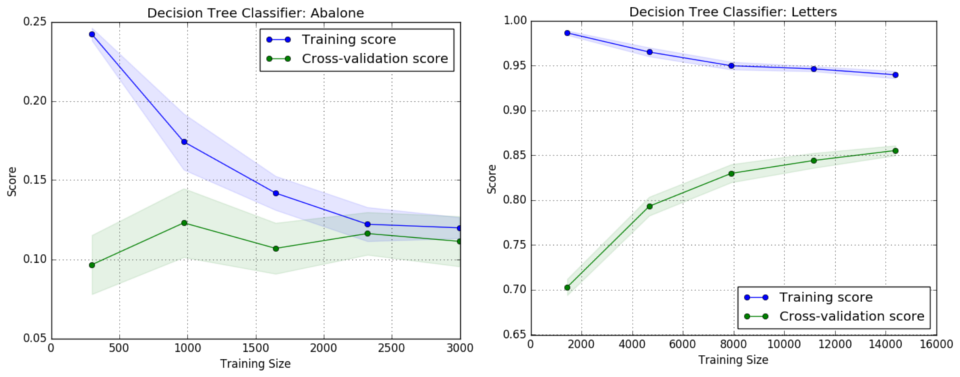
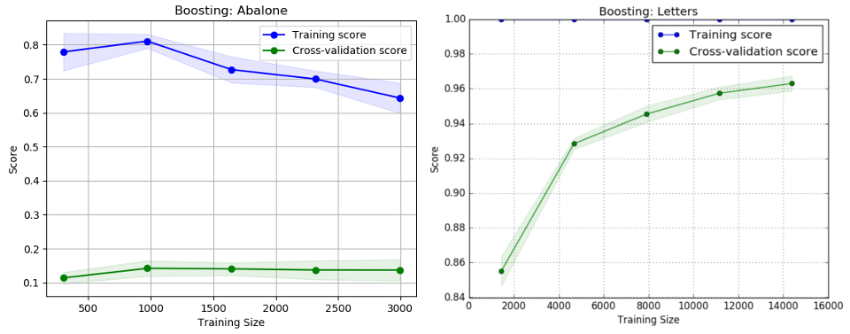
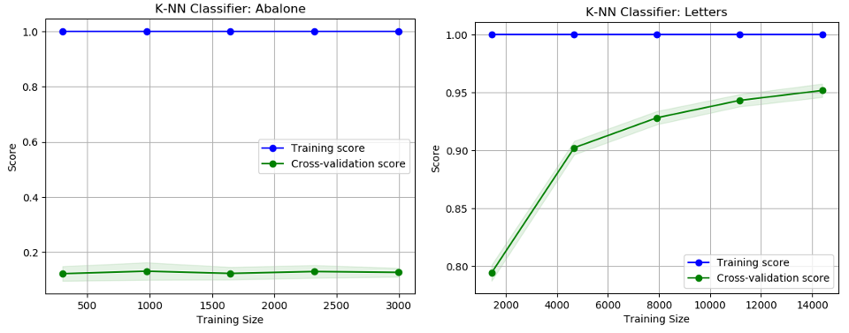
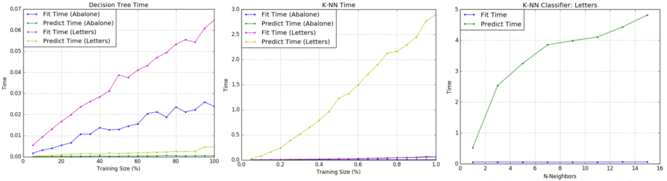
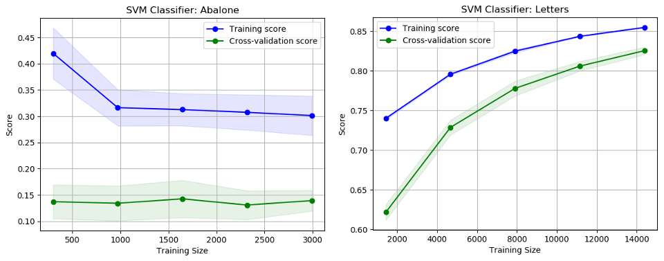
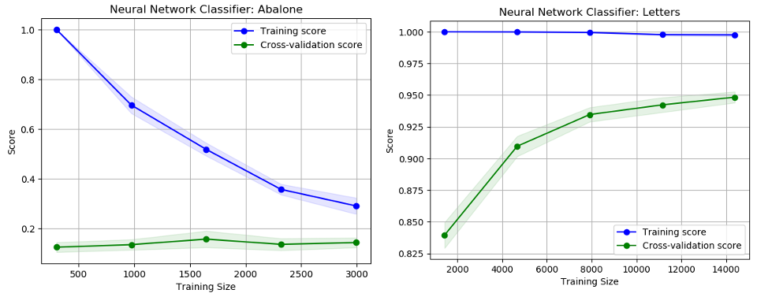

# Supervised Learning

# Introduction
This report explores five supervised learning techniques: decision trees, boosting, k-nearest neighbors, support vector machines, and neural networks. 

# Datasets
The code requires the following UCI Machine Learning datasets:

Dataset | Instances | Attributes | Attribute Characterics | Classes
--- | --- | --- | --- | ---
Abalone | 4,177 | 8 | Categorical, Continuous | 29
Letter Recognition | 20,000 | 16 | Integer | 26

The data was split into 80% training and 20% testing. One-hot encoding was applied to the features that were categorical (i.e. gender in Abalone). In addition, the data was scaled with Scikit-Learn’s StandardScaler. This is especially important in training data for neural networks.

### Abalone Data Set
http://archive.ics.uci.edu/ml/datasets/Abalone

This dataset addresses a problem within the field of biology. Determining the age of an abalone is a time-consuming task, which kills the organism; machine learning attempts to identify an alternative ecologically-friendly mechanism for determining the age. This dataset consists of normalized physical measurements of abalone, used to predict its age.

### Letter Recognition Data Set
http://archive.ics.uci.edu/ml/datasets/Letter+Recognition

This dataset addresses an interesting real-world problem pertaining to computer vision and modern technology. The objective is to identify letters in the English alphabet based on numerical attributes representing statistical moments and edge counts.

# Requirements
- Python 2.7.12
- numpy 1.13.3
- pandas 0.18.1
- matplotlib.pyplot 1.5.3
- time
- optparse
- scikit-learn 0.19.1

# The Algorithms

Run these commands within the code directory.

## Decision Trees

```python
# To see the learning curves and scores:
python decision_tree.py

# To generate the comparison graphs for the model hyperparameters:
python decision_tree.py -c
```

Decision Trees were applied to the datasets with pruning, using Scikit-Learn’s DecisionTreeClassifier. This classifier applies the CART (Classification and Regression Trees) algorithm, which constructs binary trees using the features that yield the largest information gain at each node. Pruning was implemented by setting the maximum depth and by controlling the number of samples at a leaf node. As expected, the learning curves for each dataset trended towards convergence.

Dataset | Pruned | Max | Depth | Min Samples Split | Min Samples Leaf | CV Score
--- | --- | --- | --- | --- | --- | ---
Abalone | No | None | 2 | 1 | 0.089
Abalone | Yes | 7 | 12 | 5 | 0.117
Letter Recognition | No | None | 2 | 1 | 0.878
Letter Recognition | Yes | 12 | 2 | 1 | 0.858




## Boosting

```python
# To see the learning curves and scores:
python boosting.py

# To generate the comparison graphs for the model hyperparameters:
python boosting.py -c
```

The boosting techniques were  applied using Scikit-Learn’s AdaBoostClassifier to fit a sequence of weak learners, (DecisionTreeClassifiers) on repeatedly modified versions of the data. Max depth was explored again to see how ensemble learning could iteratively combine simpler models to improve performance. Furthermore, the number of estimators was applied to investigate its impact on converging to an optimized model.These experiments reveal the improvements of boosting, and how pruning can be more aggressive. The improvements in performance in both datasets indicate that boosting effectively modified the weights to focus on the more difficult cases.

Dataset | Max Depth | Iterations/Estimators | CV Score
--- | --- | --- | ---
Abalone | 5 | 30 | 0.155
Letter Recognition | 10 | 50 | 0.962



## K-Nearest Neighbor

```python
# To see the learning curves and scores:
python knn.py

# To generate the comparison graphs for the model hyperparameters:
python knn.py -c
```

For the k-nearest neighbors algorithm, Scikit-Learn’s  KNeighborsClassifier was implemented. The primary effect of tuning hyperparameters is that using distance weighting yielded training scores of 1.0, whereas using uniform weighting yielded low training scores. Although the K-NN algorithm failed to produce significant improvements or trends in accuracy, the algorithm did reveal interesting metrics in time performance and the curse of dimensionality. By using all 16 features, there should be 2^16 data samples, or over 60,000. An improvement could be made by reducing the dimensionality and selecting important features through a method such as principle component analysis. The experiments clearly demonstrate the contrast between an eager learner (Decision Trees), with that of a lazy learner (K-NN).





## Support Vector Machines

```python
# To see the learning curves and scores:
python svm.py

# To generate the comparison graphs for the model hyperparameters:
python svm.py -c
```

Support Vector Machines were applied to the datasets using Scikit-Learn’s SVC. This technique is effective in high dimensional spaces, which should prove useful on these datasets that have a relatively high number of features. The SVM technique proved to be very costly in terms of computation time, both in terms of sample size as well as tuning hyper parameters. Both fitting and predicting took significantly longer than other learning models.

Dataset | Kernel | Degree | Gamma | CV Score
--- | --- | --- | --- | ---
Abalone | Linear | N/A | N/A | 0.145
Abalone | RBF | N/A | 1 / n_features | 0.139
Abalone | Polynomial | 3 | 1 / n_features | 0.141
Letter Recognition | Linear | N/A | N/A | 0.851
Letter Recognition | RBF | N/A | 1 / n_features | 0.941
Letter Recognition | Polynomial | 4 | 1 / n_features | 0.825




## Neural Networks

```python
# To see the learning curves and scores:
python neural_network.py

# To generate the comparison graphs for the model hyperparameters:
python neural_network.py -c
```

Neural networks were implemented to train the datasets using Scikit-Learn’s MLPClassifier, which implements a multi-layer perceptron algorithm using back propagation to set the weights. Unlike some of the other classification techniques like K-NN, neural networks requires a lot of hyper parameter tuning to find the optimal model and structure. The algorithm was applied with a neural network consisting of 1 hidden layer of 50 or 70 neurons.



## F1 Score Overview

Dataset | Decision Trees | Boosting | K-NN | SVM Neural Networks
--- | --- | --- | --- | ---
Abalone | 0.112 | 0.149 | 0.137 | 0.143 | 0.164
Letter Recognition | 0.854 | 0.965 | 0.959 | 0.948 | 0.950

